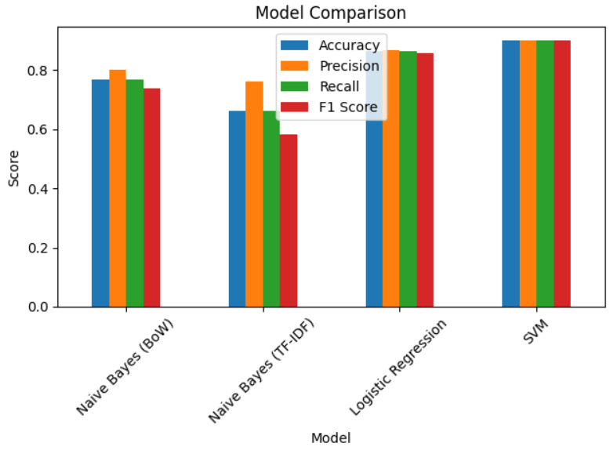
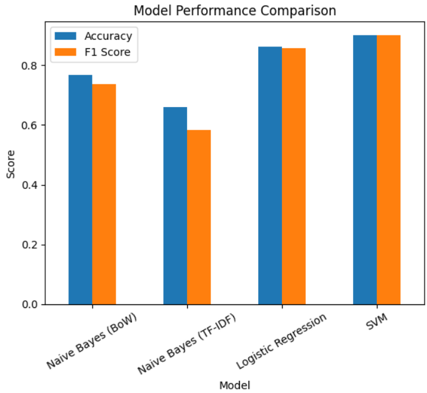
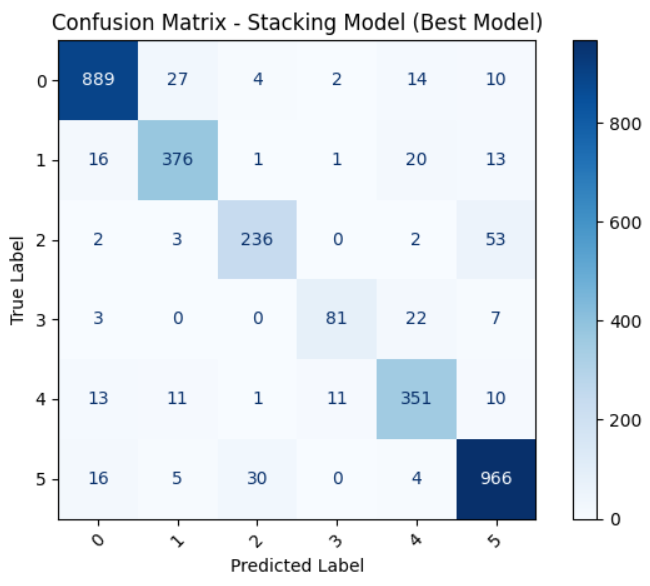
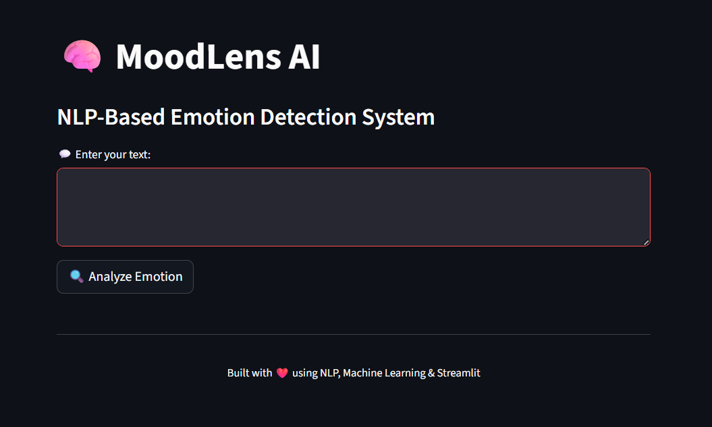
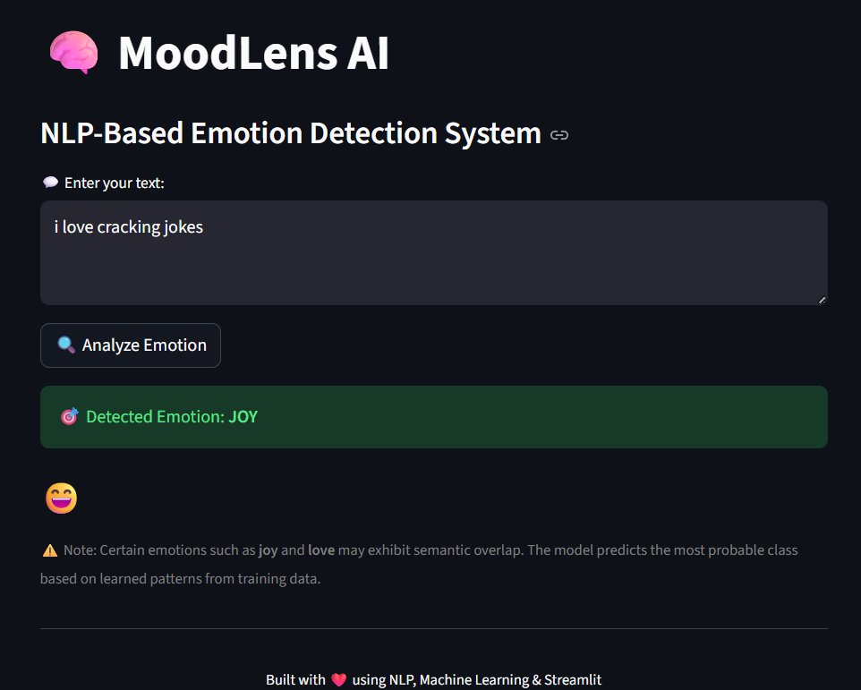

# 🧠 MoodLens AI: Emotion Detection from Text

MoodLens AI is an NLP-based emotion detection system that analyzes user text and predicts the underlying emotion using machine learning models. The system is built using TF-IDF feature extraction and multiple classification algorithms, with a final deployed Streamlit web application for real-time predictions.

---

## 🚀 Live Demo
🔗 https://moodlens-emotion-ai.streamlit.app/

---

## 📌 Project Overview

Understanding human emotions from text is a key task in Natural Language Processing (NLP).  
This project focuses on building an end-to-end pipeline that:

- Cleans and preprocesses text data  
- Converts text into numerical features using TF-IDF  
- Trains multiple machine learning models  
- Compares performance across models  
- Deploys the best model using a Streamlit UI  

---

## ⚙️ Tech Stack

- Python  
- Scikit-learn  
- Pandas, NumPy  
- NLTK  
- Streamlit  

---

## 🧠 Models Implemented

- Naive Bayes (BoW)
- Naive Bayes (TF-IDF)
- Logistic Regression
- Support Vector Machine (SVM)
- Stacking Ensemble (Final Model)

---

## 📊 Model Performance Comparison

| Model                     | Accuracy | F1 Score |
|--------------------------|----------|----------|
| Naive Bayes (BoW)        | 76.8%    | 73.7%    |
| Naive Bayes (TF-IDF)     | 66.0%    | 58.2%    |
| Logistic Regression      | 86.3%    | 85.7%    |
| SVM                      | 90.5%    | 89.9%    |
| **Stacking (Best)**      | **90.6%** | **~90%** |

---

## 📈 Visualization

### 🔹 Model Comparison Graph


### 🔹 Accuracy vs F1 Score


### 🔹 Confusion Matrix (Best Model - Stacking)


---

## 🖥️ Streamlit Application UI

### 🔹 Input Interface


### 🔹 Prediction Output


---

## ✨ Features

- Real-time emotion prediction  
- Clean and interactive UI  
- Emoji-based response system  
- Multiple model comparison  
- Ensemble learning implementation  
- Professional deployment-ready structure  

---

## 🧠 Key Insights

- SVM performed best due to its effectiveness in handling high-dimensional sparse text data  
- Naive Bayes performed moderately but struggled with TF-IDF representation  
- Stacking Ensemble slightly improved performance by combining multiple models  
- Some emotions (e.g., joy and love) show semantic overlap, leading to occasional misclassification  

---

## 📂 Project Structure

Emotion-AI/
│
├── app.py
├── model.pkl
├── tfidf.pkl
├── label_map.pkl
├── requirements.txt
├── notebook.ipynb
└── images/


---

## ▶️ Run Locally

```bash
git clone https://github.com/shubhamnegi001/moodlens-ai.git
cd moodlens-ai
pip install -r requirements.txt
streamlit run app.py


🌍 Deployment

The application is deployed using Streamlit Cloud.

💡 Future Improvements

Deep Learning models (LSTM, BERT)
Emotion probability visualization
Chat-style interface
User history tracking

👨‍💻 Author

Shubham Negi
Electronics & Communication Engineering | AI/ML Enthusiast

⭐ If you like this project

Give it a star ⭐ on GitHub and connect on LinkedIn!
